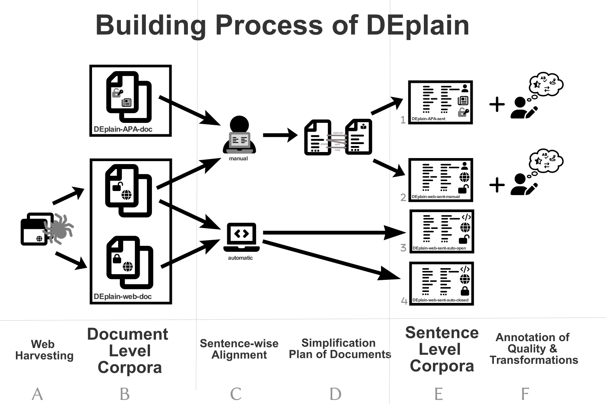

# DEPlain: A German Parallel Corpus with Intralingual Translations into Plain Language for Sentence and Document Simplification
To advance sentence simplification and document simplification in German, we present DEplain, a new dataset of parallel, professionally written and manually aligned simplifications in plain German ("plain DE" or in German: "Einfache Sprache"). 

More details can be found in our paper: Stodden, Momen, Kallmeyer (2023). ["DEplain: A German Parallel Corpus with Intralingual Translations into Plain Language for Sentence and Document Simplification."](https://arxiv.org/abs/2305.18939) In Proceedings of the 61st Annual Meeting of the Association for Computational Linguistics (Volume 1: Long Papers), Toronto, Canada. Association for Computational Linguistics.

## Contributions
Overall, our paper contains the following contributions. A more detailed description and the ressources per contribution can be found in the corresponding/linked subdirectories:
<ol type="A">
    <li> A <a target="_blank" href="https://github.com/rstodden/data_collection_german_simplification">web harvester</a> to download and harvest parallel documents with standard German and plain German, </li>
    <li> Two <a href="https://github.com/rstodden/DEPlain/tree/main/B%20--%20Document-level%20Corpus" target="_blank">document simplification datasets</a>,</li>
    <li> Sentence-wise Alignment (manually using <a href="https://github.com/rstodden/TS_annotation_tool" target="_blank">TS-ANNO</a> and automatically using some <a href="https://github.com/rstodden/DEPlain/tree/main/C%20--%20Alignment%20Algorithms" target="_blank">aligment algorithms</a>), </li>
    <li> A <a href="https://github.com/rstodden/DEPlain/tree/main/D%20--%20Simplification%20Plans" target="_blank">simplification plan</a> per document based on the manually sentence-wise alignments,</li>
    <li> Four <a href="https://github.com/rstodden/DEPlain/tree/main/E%20--%20Sentence-level%20Corpus" target="_blank">sentence simplification datasets</a>, </li>
    <li> Some <a href="https://github.com/rstodden/DEPlain/tree/main/F%20--%20Human%20Annotations" target="_blank">Human Annotations</a> on the manual aligned sentence pairs,</li>
    <li> Automatic <a href="https://github.com/rstodden/DEPlain/tree/main/G%20--%20Automatic%20Text%20Simplification%20Experiments" target="_blank">text simplification models</a> for document simplification and sentence simplification.</li>
    </li>
</ol>


The following figure  shows the connection between the contributions made in our paper. The document level corpora (B) and the sentence level corpora (E) are used for training and evaluating the automatic text simplification models (F). 




## Corpora Statistics

Metadata of the resulting subcorpora are shown in the table below:

| | Name   | License | # Doc. Pairs (train/dev/test) | # Original Sents | # Simple Sents. | Alignment | # Sent. Pairs (train/dev/test) | Corpus Name Doc. | Corpus Name Sent.|
|--------|-------------------------------|------------------|------------------------|----------------------------|---------------------------|--------------------|-------------------------|--------------------|-------------------------|
|1 | DEplain-apa | upon request     | 483  (387/48/48)    | 25,607       | 26,471      | manual             | 13,122 (10,660/1,231/1,231)    | [DEplain-APA-doc](./B -- Document-level Corpus/DEplain-APA-doc) | [DEplain-APA-sent](./E -- Sentence-level Corpus/DEplain-APA-sent) |
|2| DEplain-web     | open             | 147  (-/-/147)     | 6,138        | 6,402       | manual             | 1,846  (-/-/1846)    | [DEplain-web-doc-manual-open](./B -- Document-level Corpus/DEplain-web-doc/manual/open) | [DEplain-web-sent-manual-open](./E -- Sentence-level Corpus/DEplain-web-sent-manual-open) |
|3| DEplain-web       | open             | 249 (199/50/-)     | 7,087        | 7,760       | auto               | 652 (514/138/-)      | [DEplain-web-doc-auto-open](./B -- Document-level Corpus/DEplain-web-doc/auto/open) | [DEplain-web-sent-auto-open](./E -- Sentence-level Corpus/DEplain-web-sent/auto/open) |
|4| DEplain-web       | closed           | 360 (288/72/-)     | 12,847       | 18,068      | auto               | 942  (767/175/-)      | [DEplain-web-doc-auto-closed](./B -- Document-level Corpus/DEplain-web-doc/auto/closed) | [DEplain-web-sent-auto-closed](./E -- Sentence-level Corpus/DEplain-web-sent/auto/closed) |
|| In total              | mixed            | 1,239 (874/170/195)   | 51,681       | 58,701      | mixed              | 16,562 (11,941/1,544/3,077)   | | |

## Data Availability
### Document Simplification
Please check [https://github.com/rstodden/DEPlain/tree/main/B%20--%20Document-level%20Corpus](https://github.com/rstodden/DEPlain/tree/main/B%20--%20Document-level%20Corpus) for information on how to access our document simplification corpora (DEplain-APA-doc and DEplain-web-doc). For DEplain-APA, please request the access via [DEplain-APA zenodo repository](https://zenodo.org/record/7674560). The documents of DEplain-web with open licenses are provided [here](https://github.com/rstodden/DEPlain/tree/main/B%20--%20Document-level%20Corpus/DEplain-web-doc); the documents with closed licenses can be downloaded using the [web crawler](https://github.com/rstodden/DEPlain/tree/main/A%20--%20Web%20Harvester).


### Sentence Simplification
Please check [https://github.com/rstodden/DEPlain/tree/main/E%20--%20Sentence-level%20Corpus](https://github.com/rstodden/DEPlain/tree/main/E%20--%20Sentence-level%20Corpus) for information on how to access our sentence simplification corpora (DEplain-APA-sent and DEplain-web-sent). For DEplain-APA, please request the access via [DEplain-APA zenodo repository](https://zenodo.org/record/7674560). The [manually aligned sentence pairs]((https://github.com/rstodden/DEPlain/tree/main/E%20--%20Sentence-level%20Corpus/DEplain-web-sent)) of DEplain-web and the [automatic aligned sentence pairs](https://github.com/rstodden/DEPlain/tree/main/E%20--%20Sentence-level%20Corpus/DEplain-web-sent) with an open license can directly downloaded from the repository. If you downloaded the documents of DEplain-web with a closed license, you can automatically align these documents using one of the provided [alignment algorithms](https://github.com/rstodden/DEPlain/tree/main/C%20--%20Alignment%20Algorithms).


## Reproduction of Results of the Paper
### Reproduction of Automatic Sentence Alignment
For reproduction of our experiments regarding automatic sentence-wise alignment, please see [https://github.com/rstodden/DEPlain/tree/main/C%20--%20Alignment%20Algorithms](https://github.com/rstodden/DEPlain/tree/main/C%20--%20Alignment%20Algorithms).

### Reproduction of Automatic Text Simplification
For reproduction of our experiments regarding automatic document simplification and sentence simplification, please see [https://github.com/rstodden/DEPlain/tree/main/G%20--%20Automatic%20Text%20Simplification%20Experiments](https://github.com/rstodden/DEPlain/tree/main/G%20--%20Automatic%20Text%20Simplification%20Experiments).


## License
The parts of the work are licensed under different licenses. Please see the corresponding subdirectory for more information on the license per contribution.

## Citation
If you use part of this work, please cite our paper:


```
@inproceedings{stodden-etal-2023-deplain,
    title = "{DE}-plain: A German Parallel Corpus with Intralingual Translations into Plain Language for Sentence and Document Simplification",
    author = "Stodden, Regina  and
      Momen, Omar  and
      Kallmeyer, Laura",
    booktitle = "Proceedings of the 61st Annual Meeting of the Association for Computational Linguistics",
    month = jul,
    year = "2023",
    address = "Toronto, Canada",
    publisher = "Association for Computational Linguistics",
    notes = "preprint: https://arxiv.org/abs/2305.18939",
}
```

## Contact:
Feel free to contact [Regina Stodden](emailto:regina.stodden@hhu.de) if you have any comments or problems with the provided materials.
