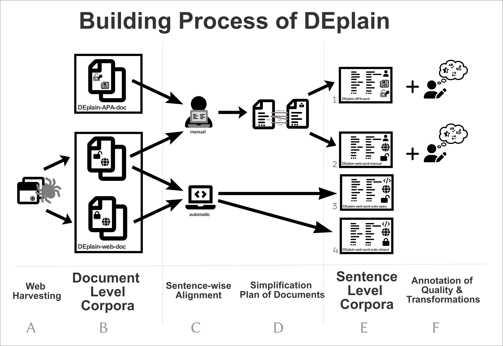

# DEPlain: A German Parallel Corpus with Intralingual Translations into Plain Language for Sentence and Document Simplification
To advance sentence simplification and document simplification in German, we present DEplain, a new dataset of parallel, professionally written and manually aligned simplifications in plain German ("plain DE" or in German: "Einfache Sprache"). 

More details can be found in our paper: Stodden, Momen, Kallmeyer (2023). ["DEplain: A German Parallel Corpus with Intralingual Translations into Plain Language for Sentence and Document Simplification."](https://arxiv.org/abs/2305.18939) In Proceedings of the 61st Annual Meeting of the Association for Computational Linguistics (Volume 1: Long Papers), Toronto, Canada. Association for Computational Linguistics.

## Contributions
Overall, our paper contains the following contributions. A more detailed description and the ressources per contribution can be found in the corresponding/linked subdirectories:
<ol type="A">
    <li> A web harvester to download and harvest parallel documents with standard German and plain German. [symlink to https://github.com/rstodden/data_collection_german_simplification]</li>
    <li> Two document simplification datasets (unannotated),</li>
    <li>  Sentence-wise Alignment: </li>
    <li> A simplification plan per document based on the manually sentence-wise alignments:</li>
    <li> Four sentence simplification datasets: </li>
    <li> Human Annotations on the manual aligned sentence pairs regarding, e.g., </li>
    <li> Automatic text simplification models for document simplification and sentence simplification</li>
    </li>
</ol>


The following figure  shows the connection between the contributions made in our paper. The document level corpora (B) and the sentence level corpora (E) are used for training and evaluating the automatic text simplification models (F). 




## Corpora Statistics

Metadata of the resulting subcorpora are shown in the table below:

| | Name                 | License | # Doc. Pairs | # Original Sents | # Simple Sents. | Alignment | # Sent. Pairs |
|--------|-------------------------------|------------------|------------------------|----------------------------|---------------------------|--------------------|-------------------------|
|1 | DEplain-apa | upon request     | 483                    | 25,607                     | 26,471                    | manual             | 13,122                  |
|2| DEplain-web                   | open             | 147                    | 6,138                      | 6,402                     | manual             | 1,846                   |
|3| DEplain-web                     | open             | 249                    | 7,087                      | 7,760                     | auto               | 652                     |
|4| DEplain-web                     | closed           | 360                    | 12,847                     | 18,068                    | auto               | 942                     |
|| In total              | mixed            | 1,239                  | 51,681                     | 58,701                    | mixed              | 16,562                  |


## License
todo.

## Citation
If you use part of this work, please cite our paper:

```
@inproceedings{stodden-etal-2023-deplain,
    title = "{DE}-plain: A German Parallel Corpus with Intralingual Translations into Plain Language for Sentence and Document Simplification",
    author = "Stodden, Regina  and
      Momen, Omar  and
      Kallmeyer, Laura",
    booktitle = "Proceedings of the 61st Annual Meeting of the Association for Computational Linguistics",
    month = jul,
    year = "2023",
    address = "Toronto, Canada",
    publisher = "Association for Computational Linguistics",
    url = "https://arxiv.org/abs/2305.18939",
    pages = "",
}

```
## Contact:
Feel free to contact [Regina Stodden](emailto:regina.stodden@hhu.de) if you have any comments or problems with the provided materials.
